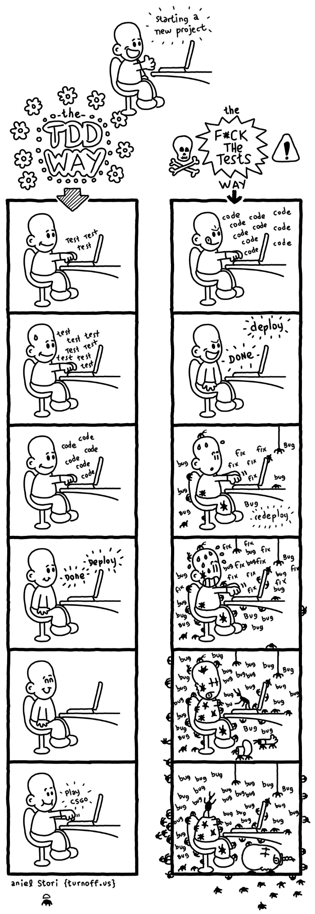

# Testing and Modules

## [In Tests We Trust - TDD with Python](https://code.likeagirl.io/in-tests-we-trust-tdd-with-python-af69f47e6932)

  - TDD stands for Test-Driven Development.
    - It is a strategy to think and write tests first.

  -  Unit tests are code written to excercise teh inout, output, and behavior of code.

## Unit Tests
### Sample Code pulled from the article

``` 
  def test_should_return_female_when_the_name_is_from_female_gender():
    detector = GenderDetector()
    expected_gender = detector.run(‘Ana’)
    assert expected_gender == ‘female’
```

1. Tests should be descriptive about what is expected and what is being tested.  

2. Test file names should be the same name as the for the module.
e.g. 
```
gender.py
test_gender.py
```

3.  Test folders should always be seperate from production folders.


## AAA
AAA is a convention that is widely used, it stands for:

### Arrange
  - Data must be organized to execute the piece of code.

### Act
  - The code being tested will be executed.

### Assert
  - Check the output to see if it matches what was being expected.

## The Cycle

The Cycle is made up of three steps:

1. Write a unit test and make it fail. (It should fail because there is no code to test, if not, then something is very wrong.)

2. Write out some code and make the test pass.

3. Refactor the code.

By doing this, you can test code everytime you work on a new feature in the code.

## Adding this image because I love it


