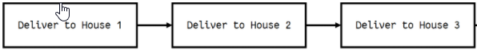

# Classes, Objects, Recursion, Fixtures, and Coverage

### Classes - A template to create objects

```
class MyClass:
    variable = "blah"

    def function(self):
        print("This is a message inside the class.")

myobjectx = MyClass()
```

### You can access variables inside of an object using '.'
```
class MyClass:
    variable = "blah"

    def function(self):
        print("This is a message inside the class.")

myobjectx = MyClass()

<!-- This will print 'blah' -->
print(myobjectx.variable)

```

### You can also access functions the same way that you would access a variable
```
class MyClass:
    variable = "blah"

    def function(self):
        print("This is a message inside the class.")

myobjectx = MyClass()

myobjectx.function()
```

### __init__ is a special function and it is called when a class is being initiated.
```
class NumberHolder:

   def __init__(self, number):
       self.number = number

   def returnNumber(self):
       return self.number

var = NumberHolder(7)
print(var.returnNumber()) #Prints '7'
```  


# Thinking Recursively

## Iterative Example
### When doing thing iteravely they can be slow and time consuming


```
houses = ["Eric's house", "Kenny's house", "Kyle's house", "Stan's house"]

def deliver_presents_iteratively():
    for house in houses:
        print("Delivering presents to", house)
```
## Recrusive Example
### Doing things recursively can save time by splitting up the tasks that need to be done. It is a function that calls upon itself inside itself until a condition is met.


```
houses = ["Eric's house", "Kenny's house", "Kyle's house", "Stan's house"]

# Each function call represents an elf doing his work 
def deliver_presents_recursively(houses):
    # Worker elf doing his work
    if len(houses) == 1:
        house = houses[0]
        print("Delivering presents to", house)

    # Manager elf doing his work
    else:
        mid = len(houses) // 2
        first_half = houses[:mid]
        second_half = houses[mid:]

        # Divides his work among two elves
        deliver_presents_recursively(first_half)
        deliver_presents_recursively(second_half)
```

## Formal Recursive Example
```
def factorial_recursive(n):
    # Base case: 1! = 1
    if n == 1:
        return 1

    # Recursive case: n! = n * (n-1)!
    else:
        return n * factorial_recursive(n-1)
```

# Fixtures
### Fixtures are used when writing tests. When you are creating objects for tets, you don't want to have to create a new object everytime
### A fixture can be used to keep you from repeating code.

### Code:
```
def reverse_lines(f):
   return [one_line.rstrip()[::-1] + '\n'
           for one_line in f]
```

### Test Fixture
```
def test_reverse_lines(simple_file):
   assert reverse_lines(simple_file) == ['cba\n', 'fed\n',
 ↪'ihg\n', 'lkj\n']
```

# Coverage
### Coverages are used when code gets too large and complex to eyeball possible failures in your tests

### Function that only mulitplies odd numbers
```
def only_odd_mul(x, y):
   if x%2 and y%2:
       return x * y
   else:
       raise NoEvenNumbersHereException(f'{x} and/or {y}
 ↪not odd')
```

### Test for the above function
```
def test_odd_numbers():
   assert only_odd_mul(3, 5) == 15
```

### In the above example, even numbers weren't tested and could cause your code to break. A covergae would be able to let you know that so that it isn't missed
```
def test_even_numbers():
   with pytest.raises(NoEvenNumbersHereException):
       only_odd_mul(2,4)
```
