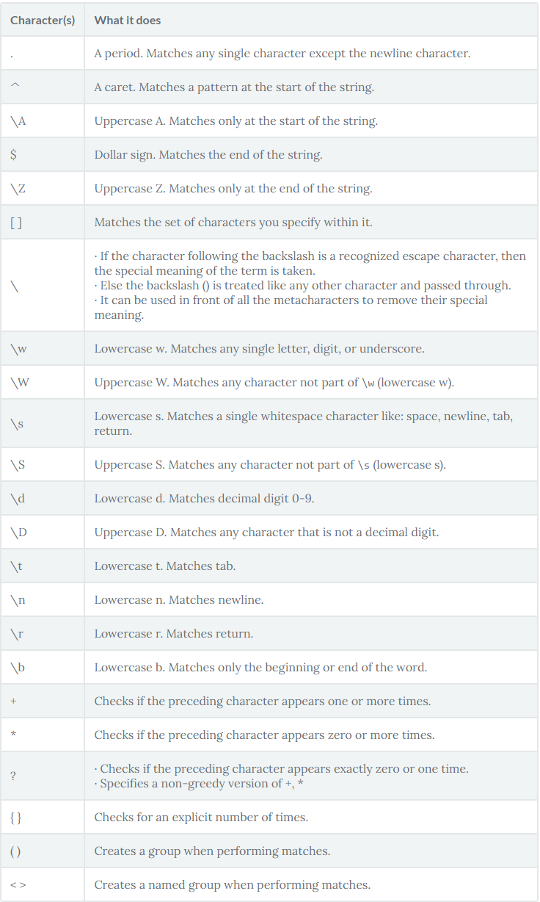

# Python Regular Expression

Regular Expressions, often shortened as regex, are a sequence of characters used to check whether a pattern exists in a given text (string) or not.  
They are used to validate the format of email addresses or passwords during registration, used for parsing text data files to find, replace, or delete certain string, etc.

Regex is used byusing import:
```
import re
```

Regex Functions:  

match():
- Returns a match object if the text matches the pattern. Otherwise, it returns None.
```
pattern = r"Cookie"
sequence = "Cookie"
if re.match(pattern, sequence):
    print("Match!")
else: print("Not a match!")  

Result:
Match!
```

search():   
- Scans through the given string/sequence, looking for the first location where the regular expression produces a match.
```
re.search(r'Co.k.e', 'Cookie').group()

Result:
'Cookie'
```

group():
- Returns the string matched by the re.

```
re.search(r'Co.k.e', 'Cookie').group()

Result:
'Cookie'
```

compile():
- You can computer a regular expression pattern into a regular expression object. When you need to use an expression several times in a single program, using compile() to save the resulting regular expression object for reuse is more efficient than saving it as a string.

findall():
- Finds all the possible matches in the entire sequence and returns them as a list of strings. Each returned string represents one match.
```
statement = "Please contact us at: support@datacamp.com, xyz@datacamp.com"

#'addresses' is a list that stores all the possible match
addresses = re.findall(r'[\w\.-]+@[\w\.-]+', statement)
for address in addresses:
    print(address)

Result:
support@datacamp.com
xyz@datacamp.com
```

finditer():
- Similar to findall() - it finds all the possible matches in the entire sequence but returns regex match objects as an iterator. The returned regex match object holds not only the sequence that matched but also their positions in the original text.
```
statement = "Please contact us at: support@datacamp.com, xyz@datacamp.com"

#'addresses' is a list that stores all the possible match
addresses = re.finditer(r'[\w\.-]+@[\w\.-]+', statement)
for address in addresses:
    print(address)

Result:
<re.Match object; span=(22, 42), match='support@datacamp.com'>
<re.Match object; span=(44, 60), match='xyz@datacamp.com'>
```
sub():
- Returns the string obtained by replacing or substituting the leftmost non-overlapping occurrences of pattern in string by the replacement repl. If the pattern is not found, then the string is returned unchanged.
```
statement = "Please contact us at: xyz@datacamp.com"
new_email_address = re.sub(r'([\w\.-]+)@([\w\.-]+)', r'support@datacamp.com', statement)
print(new_email_address)

Result:
Please contact us at: support@datacamp.com
```

split():
- This splits the strings wherever the pattern matches and returns a list. If the optional argument maxsplit is nonzero, then the maximum 'maxsplit' number of splits are performed.
```
statement = "Please contact us at: xyz@datacamp.com, support@datacamp.com"
pattern = re.compile(r'[:,]')

address = pattern.split(statement)
print(address)

Result:
['Please contact us at', ' xyz@datacamp.com', ' support@datacamp.com']
```

