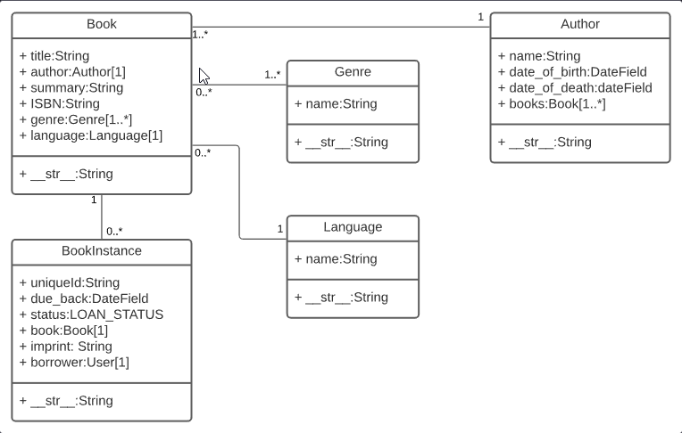

# Django Models

Django web applications access and manage data through Python objects referred to as models. Models define the structure of stored data, including the field types and possibly also their maximum size, default values, selection list options, help text for documentation, label text for forms, etc.

When designing your models it makes sense to have separate models for every "object" (a group of related information).

You might also want to use models to represent selection-list options (e.g. like a drop down list of choices), rather than hard coding the choices into the website itself — this is recommended when all the options aren't known up front or may change.

Once we've decided on our models and field, we need to think about the relationships. Django allows you to define relationships that are one to one (OneToOneField), one to many (ForeignKey) and many to many (ManyToManyField).



## Model Definition

Models are usually defined in an application's models.py file. They are implemented as subclasses of django.db.models.Model, and can include fields, methods and metadata. The code fragment below shows a "typical" model, named MyModelName:
```
from django.db import models

class MyModelName(models.Model):
    """A typical class defining a model, derived from the Model class."""

    # Fields
    my_field_name = models.CharField(max_length=20, help_text='Enter field documentation')
    ...

    # Metadata
    class Meta:
        ordering = ['-my_field_name']

    # Methods
    def get_absolute_url(self):
        """Returns the url to access a particular instance of MyModelName."""
        return reverse('model-detail-view', args=[str(self.id)])

    def __str__(self):
        """String for representing the MyModelName object (in Admin site etc.)."""
        return self.my_field_name
```

## Fields

A model can have an arbitrary number of fields, of any type — each one represents a column of data that we want to store in one of our database tables. Each database record (row) will consist of one of each field value. Let's look at the example seen below:

```
my_field_name = models.CharField(max_length=20, help_text='Enter field documentation')
```

## Common Field Arguments

The following common arguments can be used when declaring many/most of the different field types:
 - help_text: Provides a text label for HTML forms (e.g. in the admin site), as described above.

 - verbose_name: A human-readable name for the field used in field labels. If not specified, Django will infer the default verbose name from the field name.

 - default: The default value for the field. This can be a value or a callable object, in which case the  - object will be called every time a new record is created.

There are many other options — you can view the full list of field options [here](https://docs.djangoproject.com/en/3.1/ref/models/fields/#field-options)  

## Common Field Types

The following list describes some of the more commonly used types of fields.

 - CharField is used to define short-to-mid sized fixed-length strings. You must specify the max_length of the data to be stored.

 - TextField is used for large arbitrary-length strings. You may specify a max_length for the field, but this is used only when the field is displayed in forms (it is not enforced at the database level).

 There are many other types of fields, including fields for different types of numbers (big integers, small integers, floats), booleans, URLs, slugs, unique ids, and other "time-related" information (duration, time, etc.). You can view the full list [here](https://docs.djangoproject.com/en/3.1/ref/models/fields/#field-types).

## Metadata
You can declare model-level metadata for your Model by declaring class Meta, as shown.

One of the most useful features of this metadata is to control the default ordering of records returned when you query the model type.
```
class Meta:
    ordering = ['-my_field_name']
```

## Methods

Minimally, in every model you should define the standard Python class method __str__() to return a human-readable string for each object. 
```
def __str__(self):
    return self.field_name
```


